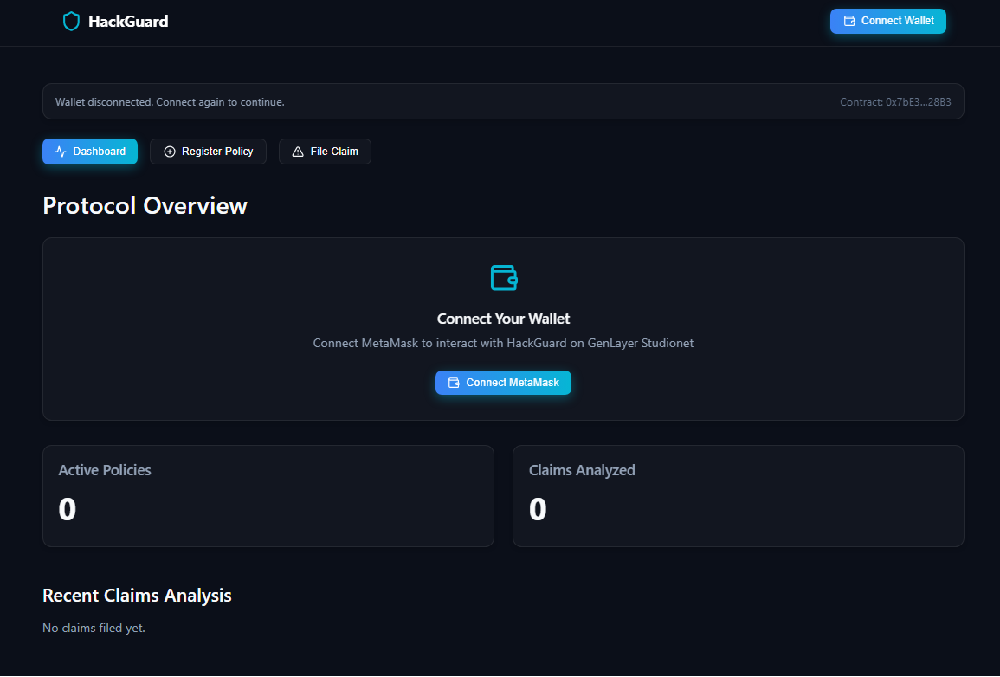

# HackGuard 🛡️



**Parametric DeFi Hack Insurance — Powered by GenLayer AI Consensus**

HackGuard is a GenLayer intelligent contract that provides autonomous, AI-driven hack insurance for DeFi protocols. When a hack is reported, the contract fetches evidence from exploit reports and block explorers, uses LLM consensus among validators to verify the exploit, and automatically processes claims — no human adjusters needed.

## How It Works

```
1. Protocol registers insurance policy → register_policy()
2. Hack occurs → Anyone files a claim with evidence URLs → file_claim()
3. GenLayer fetches exploit articles + block explorer data
4. LLM analyzes: real hack or false alarm?
5. Validators independently verify → consensus reached
6. Claim auto-approved or rejected with full analysis
```

## Contract Methods

| Method | Type | Description |
|--------|------|-------------|
| `register_policy(protocol_name, protocol_url, coverage_amount_usd, created_at)` | write | Register a DeFi protocol for hack insurance |
| `deactivate_policy(policy_id)` | write | Owner deactivates their policy |
| `file_claim(policy_id, evidence_url, explorer_url, description)` | write | File a hack claim — triggers AI investigation |
| `get_policy(policy_id)` | view | Get policy details |
| `get_claim(claim_id)` | view | Get claim verdict and analysis |
| `get_policy_count()` | view | Total registered policies |
| `get_claim_count()` | view | Total filed claims |

## AI Analysis Output

When a claim is filed, the AI evaluates and returns:

```json
{
  "is_hack": true,
  "status": "APPROVED",
  "severity": "CRITICAL",
  "confidence": 92,
  "loss_estimated_usd": 197000000,
  "attack_vector": "reentrancy",
  "analysis_summary": "Multiple sources confirm unauthorized fund drain...",
  "red_flags": "Large outflow to unknown address, unverified contract upgrade"
}
```

## Severity Levels

| Level | Description |
|-------|-------------|
| CRITICAL | >$10M loss, protocol-breaking exploit |
| HIGH | $1M-$10M loss, significant vulnerability |
| MEDIUM | $100K-$1M loss, limited exploit |
| LOW | <$100K loss, minor vulnerability |
| NONE | Not a hack / false alarm |

## Deployment

1. **Deploy Contract:** Run the local deploy script. It requires a `.env` file containing your private key:
   ```bash
   node deploy.js
   ```
   *Note: Ensure your `.env` contains `PRI_KEY=your_private_key`. The `.env` file is excluded from version control.*

2. **Frontend Setup:**
   Navigate to the frontend directory:
   ```bash
   cd frontend
   npm install
   npm run dev
   ```
   *Note: The frontend uses MetaMask for all transactions and connects directly to the GenLayer Studionet.*

## Testing the Application

The frontend includes a built-in **⚡ Try Example** button on both the Register Policy and File Claim forms.
Simply click the button to cycle through 20 real-world DeFi hacks (e.g., Euler Finance, Ronin Bridge, Wormhole).

When you submit a claim, MetaMask will prompt you to approve the transaction. Once approved, the GenLayer validators will independently fetch the evidence, run their LLM analysis, and reach a consensus verdict displayed directly on your dashboard.

## Built On

- [GenLayer](https://genlayer.com) — Intelligent contracts with AI consensus
- [genlayer-js](https://github.com/genius-ventures/genlayer-js) — TypeScript SDK
- React & Vite — Modern frontend stack
- Deployed on GenLayer Studionet

## License

This project is licensed under the MIT License.
